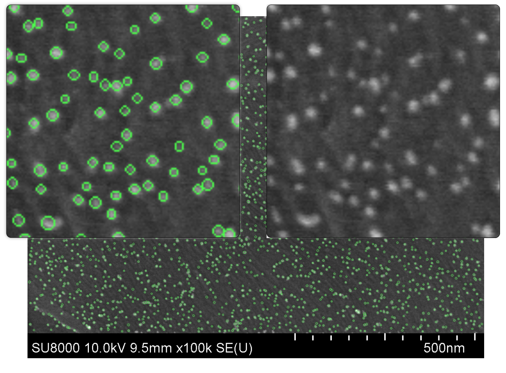
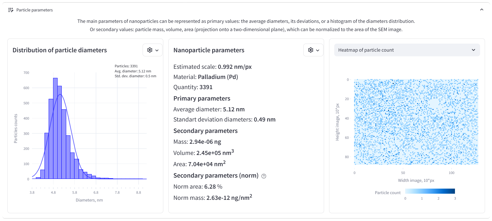
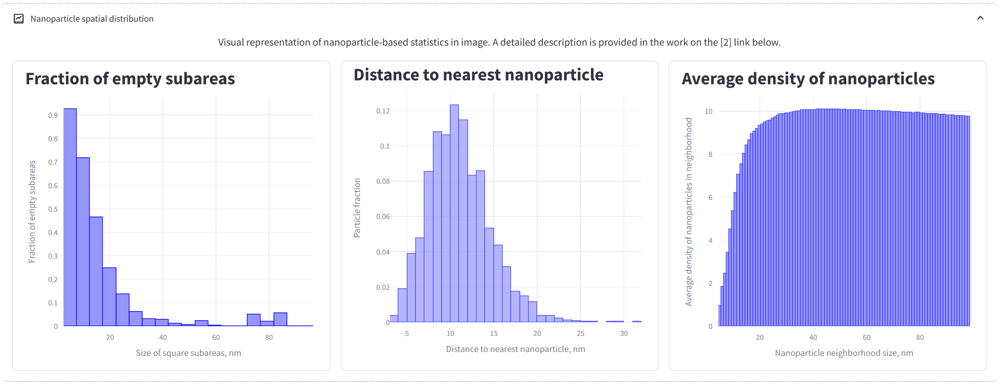
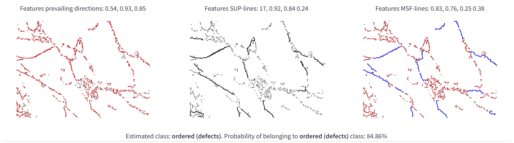
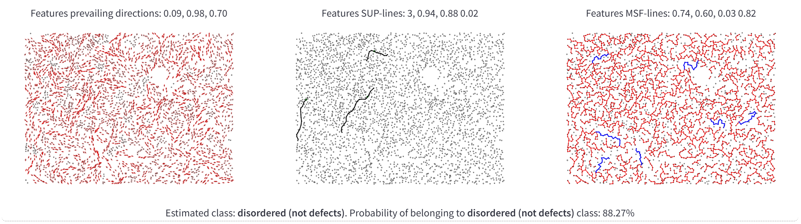

# Nano-Website

Веб-приложение на Python для автоматизированного анализа изображений, полученных с электронного микроскопа.

**Область применения:** компьютерное зрение, анализ изображений электронной микроскопии (SEM), машинное обучение


## Возможности

* автоматическое детектирование наночастиц на СЭМ-изображениях
* оценка структурированности взаимного расположения наночастиц
* выявление дефектных областей поверхности материала на основе анализа структурированности
* работа через веб-интерфейс


## Технологии

| Основной язык | Веб-интерфейс | Компьютерное зрение | Визуализация |
|---------------|--------------|---------------------|--------------|
| Python | Streamlit | EasyOCR, OpenCV, Scikit-image | Plotly |


## Структура проекта

* `nano-website.py` — основной файл запуска приложения
* `content/` — вспомогательные материалы (ML-модели, тестовые изображения, подсказки)
* `utils/` — алгоритмы анализа и математические расчёты
* `requirements.txt` — зависимости проекта


## Установка (Linux)

1. Клонировать репозиторий:

```bash
# Initial packages installation for Python projects
# sudo apt install -y git python3-full build-essential
git clone https://github.com/muwsik/nano-website.git
cd nano-website/nano-website
```

2. (Рекомендуется) создать виртуальное окружение:

```bash
python -m venv venv
source venv/bin/activate
```

3. Установить зависимости:

```bash
pip install -r requirements.txt
```


## Запуск

```bash
streamlit run nano-website.py
```

После запуска приложение будет доступно в браузере!


## Использование и документация

### Работа с приложением

1. Загрузить изображение электронной микроскопии через веб-интерфейс.  
2. Запустить автоматический анализ (обычно до 1 минуты).  
3. Просмотреть результаты детектирования наночастиц, их параметров и оценки структурированности.  

Подробное описание интерфейса доступно в разделе **Help** внутри веб-приложения.

### Дополнительные материалы:

- 📄 [Интеграция с CVAT и оценка качества детектирования](https://disk.yandex.ru/i/2U5wgJ8IjskREQ)


### Примеры результатов работы

#### Детектирование наночастиц


#### Анализ параметров наночастиц



#### Оценка структурированности и наличие дефектов поверхности




## Связанные публикации

Методы, реализованные в данном проекте, основаны на результатах следующих научных работ:

1. **Boiko D.A., Sulimova V.V., Kurbakov M.Yu. et al.**
   Automated Recognition of Nanoparticles in Electron Microscopy Images of Nanoscale Palladium Catalysts.
   *Nanomaterials*, 2022, Vol. 12, No. 21, p. 3914.
   https://doi.org/10.3390/nano12213914

2. **Kurbakov M.Yu., Sulimova V.V., Kopylov A.V. et al.**
   Determining the Orderliness of Carbon Materials with Nanoparticle Imaging and Explainable Machine Learning.
   *Nanoscale*, 2024, Vol. 16, No. 28, pp. 13663–13676.
   https://doi.org/10.1039/d4nr00952e

3. **Kurbakov M.Yu., Sulimova V.V., Seredin O.S., Kopylov A.V.**
   Interpretable Graph Methods for Determining Nanoparticles Ordering in Electron Microscopy Images.
   *Computer Optics*, 2025, Vol. 49, No. 3, pp. 470–479.
   https://doi.org/10.18287/2412-6179-CO-1568


## Авторы

Kurbakov M.Yu., Sulimova V.V., Seredin O.S., Kopylov A.V., Pavlova V.S.
Laboratory of Cognitive Technologies and Simulating Systems, Tula State University
