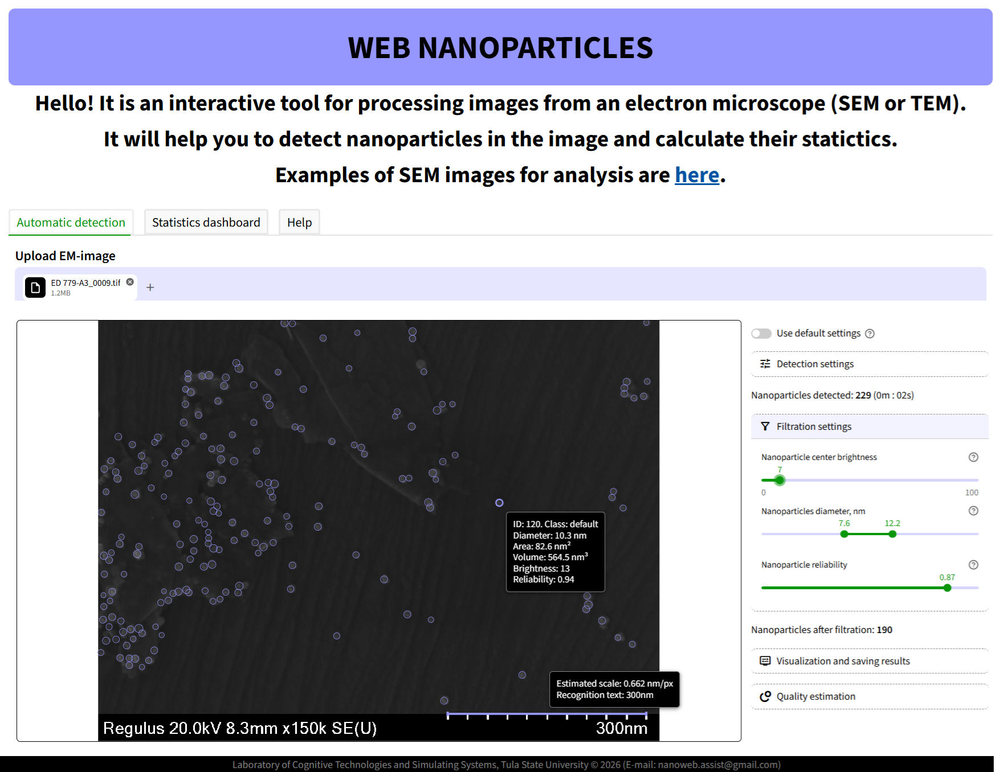
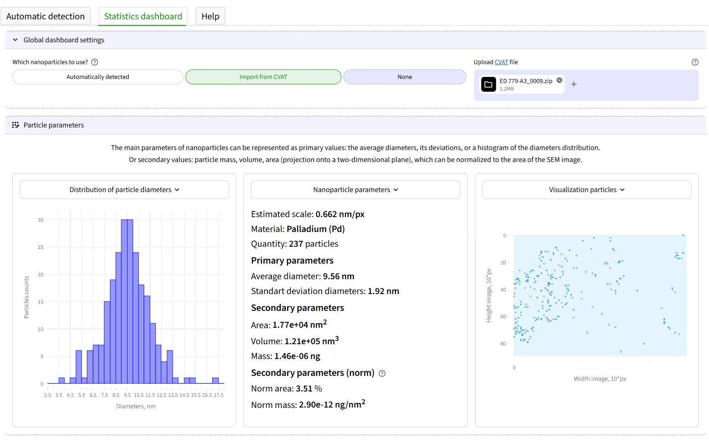
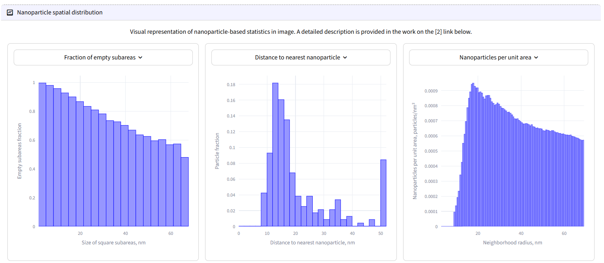
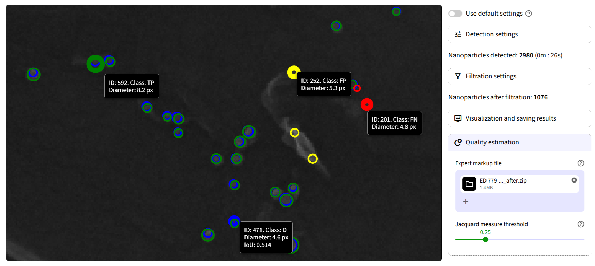

# Nano-Website

Nano Website is a web-based application for automated analysis of nanoparticles in electron microscopy images. The application is designed for detecting large numbers of very small nanoparticles, typically occupying only 1–10 pixels in an image, and provides tools for their morphometric and statistical analysis.

The application supports SEM and TEM images and includes nanoparticle detection, filtering, visualization, statistical analysis, and integration with CVAT for annotation and detection quality evaluation. It is intended to simplify quantitative analysis of nanoparticle size and spatial distribution and provide reproducible results.

**Application areas:** computer vision, machine learning, scanning/transmission electron microscopy (SEM/TEM)

## Features

* **Automatic nanoparticle detection** in SEM and TEM images.
* **Automatic image scale detection** using the scale bar in electron microscopy images.
* **Nanoparticle filtering** based on particle diameter, center brightness, and detection reliability.
* **Interactive visualization** of detected nanoparticles and their properties directly on the original image.
* **Results export** for further processing and analysis.
* **CVAT integration** for importing expert annotations and exporting detected nanoparticles for annotation and review.
* **Detection quality evaluation** using expert annotations, including TP, FP, FN, and IoU-based matching.
* **Nanoparticle size statistics**, including diameter distributions and basic morphometric characteristics.
* **Spatial distribution analysis**, including particle density, nearest-neighbor distances, and neighborhood characteristics.
* **Aggregate statistics** for combining analysis results from multiple images.
* **Interactive statistical visualization** with configurable parameters and data export.


## Technologies

| Primary Language | Web Interface | Computer Vision | Visualization | Annotation |
|:----------------:|:-------------:|:---------------:|:-------------:|:----------:|
| Python 3.12 | Streamlit | EasyOCR, Scikit-image | Plotly | CVAT |

## Project Structure

* `nano-website.py` — main application entry point
* `content/` — auxiliary resources (ML models, test images, help materials)
* `utils/` — analysis algorithms and mathematical computations
* `requirements.txt` — project dependencies

## Installation

### Windows

1. Clone the repository:

```bash
# Install Git and Python 3.11 (or newer) if they are not already installed.

git clone https://github.com/muwsik/nano-website.git
cd nano-website
```

2. (Recommended) Create and activate a virtual environment:

```bash
python -m venv nano-venv
nano-venv\Scripts\activate
```

### Linux

1. Install the required packages and clone the repository:

```bash
# Install the required packages if they are not already installed.
# sudo apt update
# sudo apt install -y git python3 python3-venv python3-pip build-essential

git clone https://github.com/muwsik/nano-website.git
cd nano-website
```

2. (Recommended) Create and activate a virtual environment:

```bash
python3 -m venv nano-venv
source nano-venv/bin/activate
```

### Install Dependencies

```bash
pip install -r nano-website/requirements.txt
```

## Running the Application

```bash
streamlit run nano-website/nano-website.py
```

The application will be available at the local address provided by Streamlit.

## Usage

### Automatic Detection

1. Upload an SEM or TEM image.
2. The application automatically determines the image scale.
3. Configure the nanoparticle detection parameters if necessary.
4. Run the automatic detection.
5. Review the detected nanoparticles and adjust filtering parameters if required.
6. Export the detection results for further analysis or annotation in CVAT.

### Statistics

1. Use the results of nanoparticle detection or import annotations from CVAT.
2. Configure the parameters required for statistical analysis.
3. Calculate nanoparticle size and spatial distribution statistics.
4. Visualize the results using interactive plots and heatmaps.
5. Add results from multiple images to the aggregate statistics.
6. Export the calculated data for further analysis.

A detailed interface description is available in the **Help** section of the web application.

### CVAT Integration and Detection Quality Evaluation

The application provides integration with **CVAT** for annotation and evaluation of nanoparticle detection results.

* Export automatically detected nanoparticles to CVAT for manual review and correction.
* Import CVAT annotations for statistical analysis.
* Compare automatically detected nanoparticles with expert annotations.
* Evaluate detection quality using **true positives (TP)**, **false positives (FP)**, and **false negatives (FN)**.
* Match detected and annotated nanoparticles using an **IoU (Intersection over Union)** threshold.
* Visualize matched and unmatched detections directly on the original image.

- Integration with CVAT and detection quality assessment (https://disk.yandex.ru/i/2U5wgJ8IjskREQ)

### Examples

#### Nanoparticle Detection


#### Nanoparticle Parameter Analysis
The application provides tools for quantitative analysis of detected nanoparticles and their spatial distribution.



#### Detection Quality Evaluation
The application provides integration with CVAT for annotation and evaluation of nanoparticle detection results.


## Related Publications

The methods implemented in this project are based on the following scientific publications:

1. **Boiko D.A., Sulimova V.V., Kurbakov M.Yu. et al.**
   Automated Recognition of Nanoparticles in Electron Microscopy Images of Nanoscale Palladium Catalysts.
   *Nanomaterials*, 2022, Vol. 12, No. 21, p. 3914.
   https://doi.org/10.3390/nano12213914

2. **Kurbakov M.Yu., Sulimova V.V., Kopylov A.V. et al.**
   Determining the Orderliness of Carbon Materials with Nanoparticle Imaging and Explainable Machine Learning.
   *Nanoscale*, 2024, Vol. 16, No. 28, pp. 13663–13676.
   https://doi.org/10.1039/d4nr00952e

3. **Kurbakov M.Yu., Sulimova V.V., Seredin O.S., Kopylov A.V.**
   Interpretable Graph Methods for Determining Nanoparticles Ordering in Electron Microscopy Images.
   *Computer Optics*, 2025, Vol. 49, No. 3, pp. 470–479.
   https://doi.org/10.18287/2412-6179-CO-1568

## Authors

Kurbakov M.Yu., Sulimova V.V., Seredin O.S., Kopylov A.V., Pavlova V.S.

Laboratory of Cognitive Technologies and Simulating Systems, Tula State University
