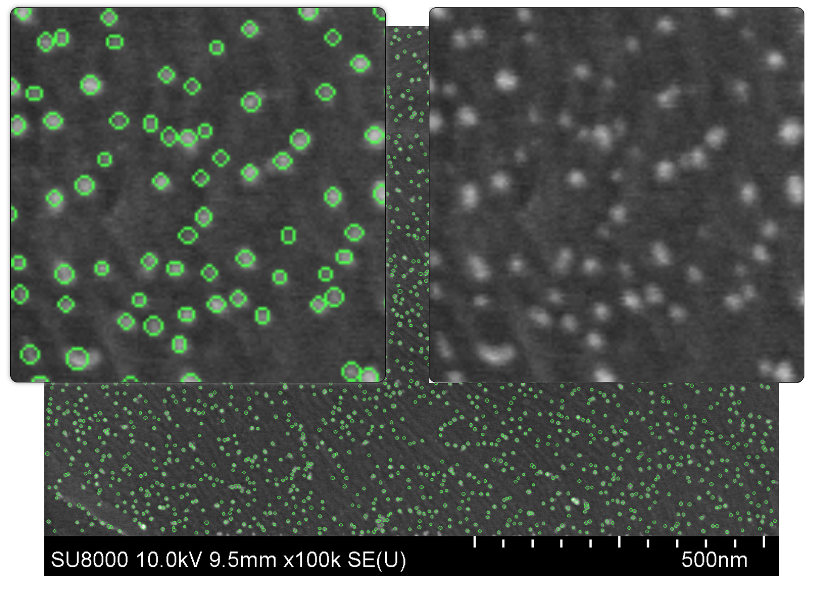
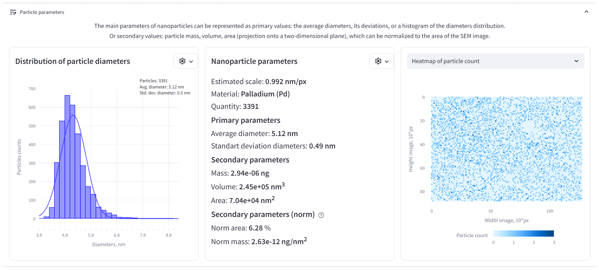
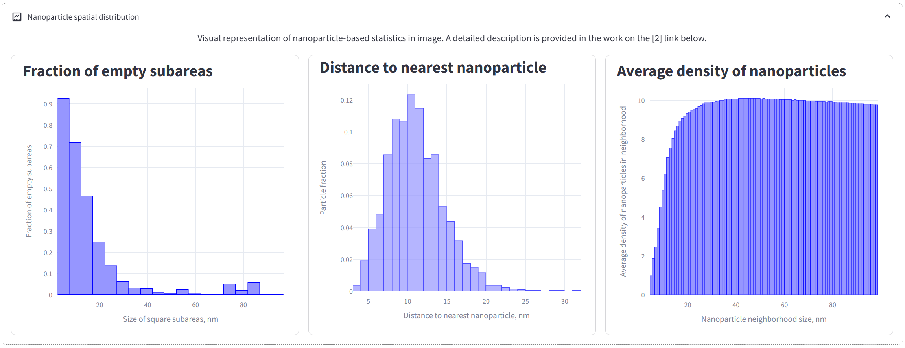
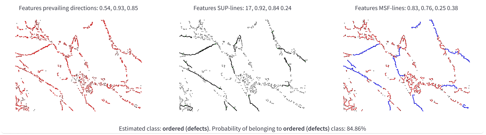
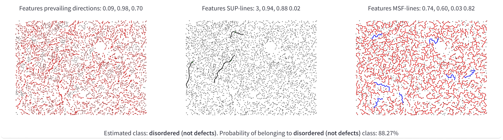

# Nano-Website

A Python web application for automated analysis of images acquired using a scanning electron microscope.

**Application areas:** computer vision, scanning electron microscopy (SEM) image analysis, machine learning

## Features

* Automatic nanoparticle detection in SEM images
* Evaluation of the spatial ordering of nanoparticles
* Detection of defective material surface regions based on structural order analysis
* Web-based user interface

## Technologies

| Primary Language | Web Interface | Computer Vision | Visualization |
|:----------------:|:-------------:|:---------------:|:-------------:|
| Python 3.11 | Streamlit | EasyOCR, OpenCV, Scikit-image | Plotly |

## Project Structure

* `nano-website.py` — main application entry point
* `content/` — auxiliary resources (ML models, test images, help materials)
* `utils/` — analysis algorithms and mathematical computations
* `requirements.txt` — project dependencies

## Installation

### Windows

1. Clone the repository:

```bash
git clone https://github.com/muwsik/nano-website.git
cd nano-website
```

2. (Recommended) Create and activate a virtual environment:

```bash
python -m venv nano-venv
nano-venv\Scripts\activate
```

### Linux

1. Install the required packages and clone the repository:

```bash
# sudo apt update
# sudo apt install -y git python3 python3-venv python3-pip build-essential

git clone https://github.com/muwsik/nano-website.git
cd nano-website
```

2. (Recommended) Create and activate a virtual environment:

```bash
python3 -m venv nano-venv
source nano-venv/bin/activate
```

### Install Dependencies

```bash
pip install -r nano-website/requirements.txt
```

## Running the Application

```bash
streamlit run nano-website/nano-website.py
```

After launching, the application will be available in your web browser.

## Usage and Documentation

### Using the Application

1. Upload a scanning electron microscopy image through the web interface.
2. Start the automatic analysis (typically takes up to 1 minute).
3. Review the detected nanoparticles, their parameters, and the structural ordering assessment.

A detailed interface description is available in the **Help** section of the web application.

### Additional Materials

- 📄 Integration with CVAT and detection quality assessment (https://disk.yandex.ru/i/2U5wgJ8IjskREQ)

### Examples

#### Nanoparticle Detection


#### Nanoparticle Parameter Analysis



#### Structural Ordering and Surface Defect Detection



## Related Publications

The methods implemented in this project are based on the following scientific publications:

1. **Boiko D.A., Sulimova V.V., Kurbakov M.Yu. et al.**
   Automated Recognition of Nanoparticles in Electron Microscopy Images of Nanoscale Palladium Catalysts.
   *Nanomaterials*, 2022, Vol. 12, No. 21, p. 3914.
   https://doi.org/10.3390/nano12213914

2. **Kurbakov M.Yu., Sulimova V.V., Kopylov A.V. et al.**
   Determining the Orderliness of Carbon Materials with Nanoparticle Imaging and Explainable Machine Learning.
   *Nanoscale*, 2024, Vol. 16, No. 28, pp. 13663–13676.
   https://doi.org/10.1039/d4nr00952e

3. **Kurbakov M.Yu., Sulimova V.V., Seredin O.S., Kopylov A.V.**
   Interpretable Graph Methods for Determining Nanoparticles Ordering in Electron Microscopy Images.
   *Computer Optics*, 2025, Vol. 49, No. 3, pp. 470–479.
   https://doi.org/10.18287/2412-6179-CO-1568

## Authors

Kurbakov M.Yu., Sulimova V.V., Seredin O.S., Kopylov A.V., Pavlova V.S.

Laboratory of Cognitive Technologies and Simulating Systems, Tula State University
